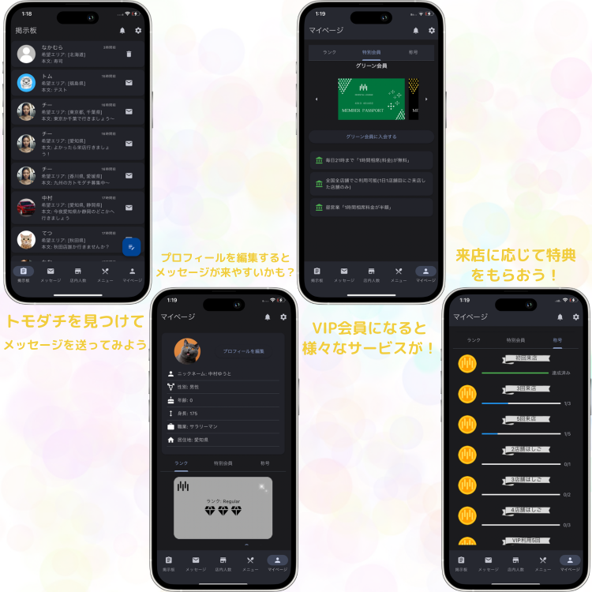

# はじめに
- このアプリはユーザーが掲示板へポストを投稿したり、他ユーザーとメッセージを行い、一緒に居酒屋へ行くトモダチを見つけるアプリです。  
- 会員登録/ログインは電話番号のみで行います。(SMS認証) テスト用の電話番号を使用したい場合は下記の"電話番号&SMS確認コード"を使用してください。  

# お急ぎの方へ
- こちらのリンクからWebブラウザでも動作を確認いただけます。(Chrome,Safari)  
- 🚨Webでは実際の電話番号でSMS認証は行えません。下記のテスト用の電話番号のみ使用できます。🚨  

https://solottesample.web.app/

# 会員登録用テスト電話番号
*電話番号&SMS確認コード6ケタ*  
- 080-1111-0000  975864  
- 080-1111-2222	 588555  
- 080-1111-3333	 432521  
- 080-1111-4444	 542343  
- 080-1111-5555	 642655  
- 080-1111-6666	 532352  
- 080-1111-7777	 756666  
- 080-1111-8888	 124141  
- 080-1111-9999	 858966  

*ゲスト用アカウント(万が一、会員登録が失敗する場合はこちらを使用してください)*  
- 080-2222-0000	 646262  

- テスト用電話番号は他の方が使用している可能性があります、その際はお手数ですが他の番号もお試しください。  

# 動作
- Firebaseの電話番号認証機能を使用してユーザーの会員登録/ログインを行う。  
- ユーザーは自分のプロフィールを編集できる。  
- ユーザーは掲示板へポストを投稿できる。  
- ユーザーは他のユーザーとメッセージができる。  
- 🚨"メニュー"タブは未実装🚨  
 

# Firestoreデータモデル(NoSQL)
- ユーザーのプロフィール  
'users'.'ユーザーUID'.各フィールド  
- 掲示板のポストデータ  
'posts'.'ランダム'.各フィールド  
- メッセージデータ(サブコレクション)  
'conversations'.'両者ののユーザーUIDの組み合わせ'.'messages'.各フィールド  
- 最近のメッセージデータ  
'conversations'.'両者ののユーザーUIDの組み合わせ'.各フィールド  

# 環境
- Flutterバージョン 3.16.7  
- Dartバージョン 3.2.4  
- プラットフォーム  
iOS 12.0以上  
Android 5.0以上  
Web(Chrome,Safari)一部機能制限有  

# 改善点
- riverpodの理解と効率的な状態管理の模索  
- UI/UXの改善  
- データベース使用料を抑えた設計  

